# Nightscout for Cloudflare 首次部署与使用教程

跟着下面的步骤操作，你可以在 Cloudflare 上免费部署自己的 Nightscout。整个部署过程通常只需要几分钟，不需要任何技术背景。

## 准备工作

开始前，请准备：

- 一个 Cloudflare 账号
- 一个 GitHub 账号

---

## 第一步：开始部署

打开 [Nightscout for Cloudflare 项目页面](https://github.com/sid-luo/nightscout-for-cloudflare)，点击橙色的 **Deploy to Cloudflare** 按钮。

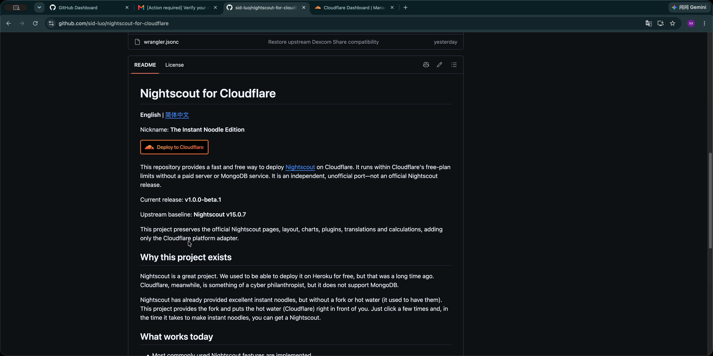

点击后，浏览器会进入 Cloudflare 的部署页面。

---

## 第二步：关联 GitHub 账号

在 Cloudflare 部署页面的 **Git account** 一栏中，点击 **New GitHub connection**。

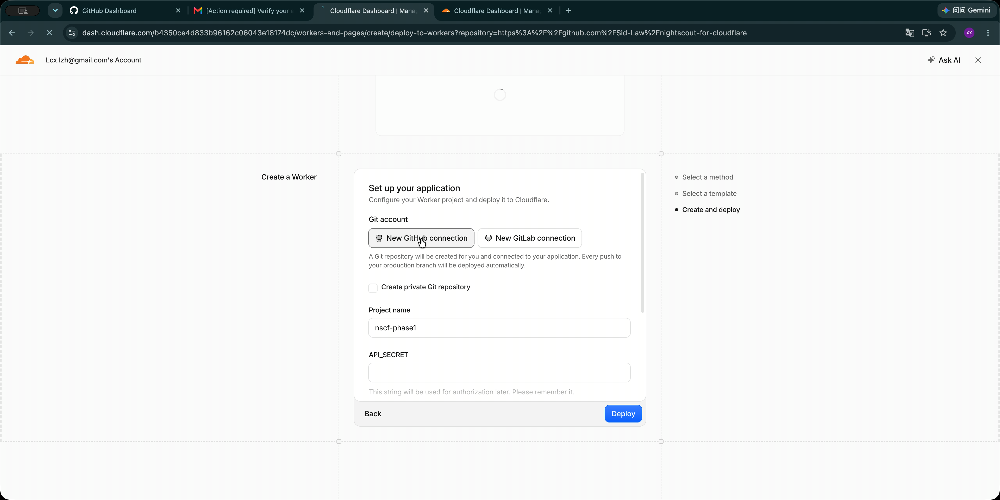

随后页面会跳转到 GitHub，要求你登录并授权 Cloudflare。

如果之前已经关联过 GitHub，页面可能会直接显示你的 GitHub 账号，不需要重复授权。

---

## 第三步：授权 Cloudflare 访问 GitHub

在 GitHub 授权页面中选择 **All repositories（所有仓库）**，然后点击绿色的 **Install & Authorize（安装并授权）**。

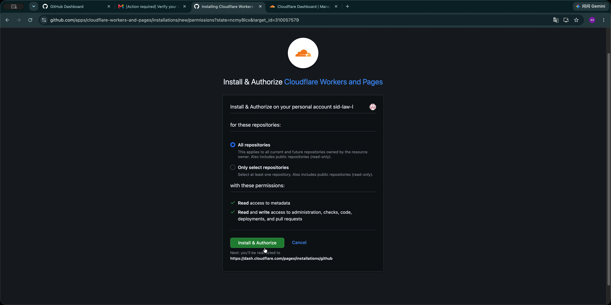

授权成功后，页面会自动返回 Cloudflare。

这里允许访问所有仓库，是因为 Cloudflare 接下来需要在你的 GitHub 账号中创建一个新的部署仓库。

---

## 第四步：填写部署信息

返回 Cloudflare 后，填写部署需要的信息：

1. 在 **Git account** 中选择刚刚绑定的 GitHub 账号。
2. 勾选 **Create private Git repository**。
3. 在 **Project name** 中填写项目名称。
4. 在 **API_SECRET** 中输入密码。

**API_SECRET 必须不少于 12 个字符，请务必记住。**

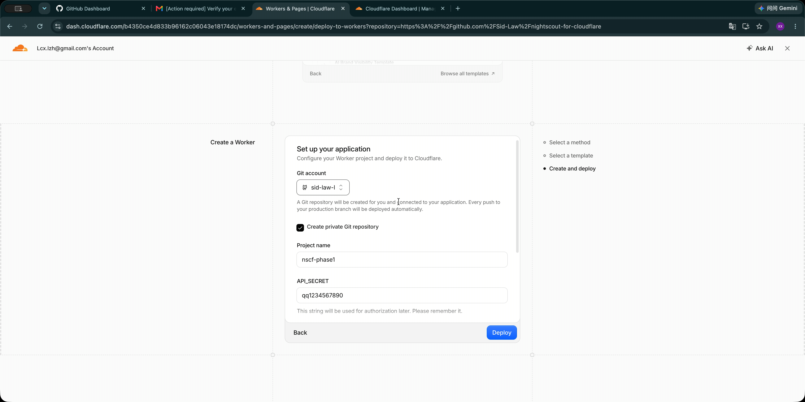

### Git 仓库

勾选 **Create private Git repository** 后，Cloudflare 会在你的 GitHub 账号中创建一个私有仓库。

### Project name

可以保留 Cloudflare 自动生成的名称，也可以修改成自己容易识别的名称。

这个名称还会成为默认 Nightscout 网址的一部分。

### API_SECRET

`API_SECRET` 是 Nightscout 的验证密码，以后进入设置和管理页面时还会使用。

请使用自己设置的密码，并妥善保存。

*当然，就算你忘记了也很容易找回来，并且可以随时修改。本教程后面有说明。*

---

## 第五步：开始部署

确认信息填写完成后，点击右下角的 **Deploy（部署）**。

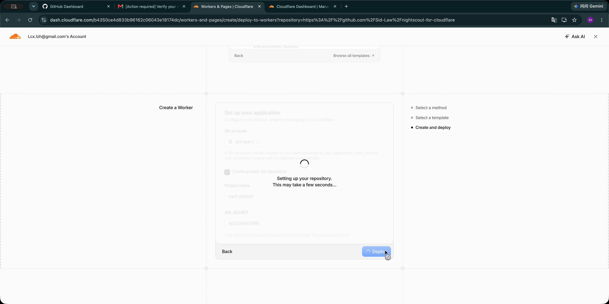

Cloudflare 会自动：

- 创建 GitHub 私有仓库
- 复制 Nightscout for Cloudflare 源码
- 安装项目依赖
- 构建程序
- 部署 Worker

这个过程不需要手动操作，请保持页面打开并耐心等待，不要重复点击 **Deploy**。

---

## 第六步：等待构建完成

进入构建页面后，什么都不需要做，继续等待即可。

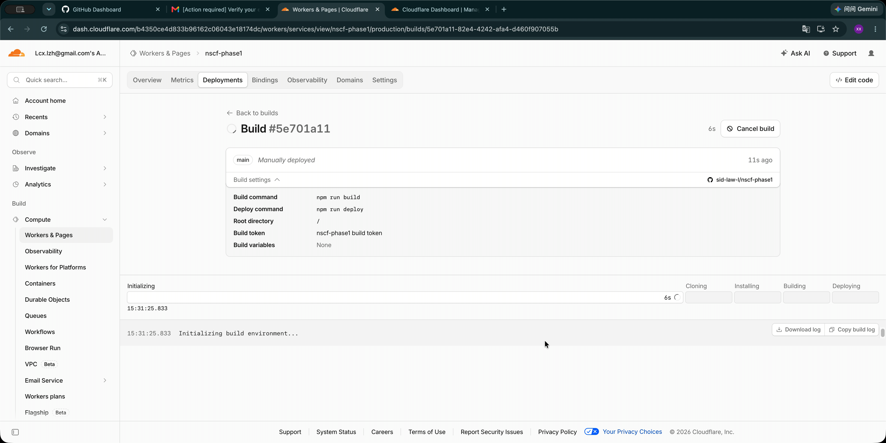

Cloudflare 会依次完成下面几个阶段：

- **Initializing**：初始化构建环境
- **Cloning**：克隆源码
- **Installing**：安装依赖
- **Building**：构建程序
- **Deploying**：部署程序

构建期间不要点击 **Cancel build（取消构建）**。

---

## 第七步：确认部署成功

整个构建过程通常需要大约 2 分钟，实际时间可能因网络和 Cloudflare 状态略有不同。

当上方所有阶段都显示绿色对勾，并且日志底部出现下面两行提示时，表示部署成功：

```text
Success: Deploy command completed
Success! Build completed.
```

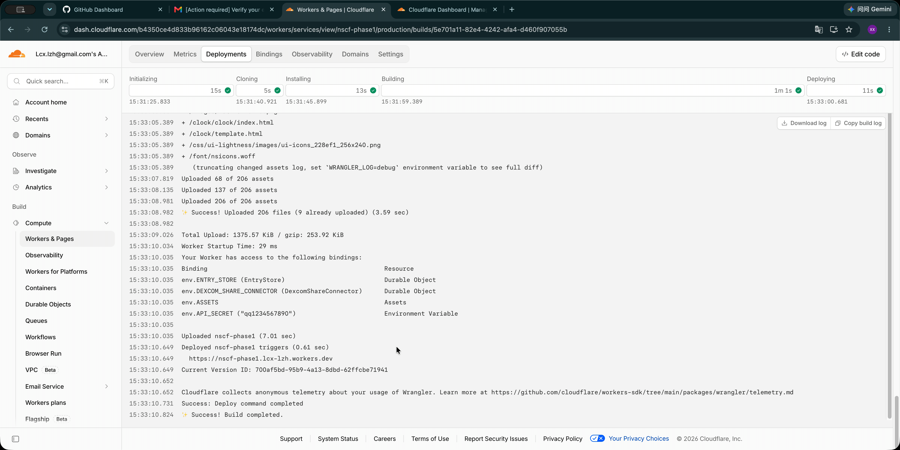

日志中还会显示一个以 `workers.dev` 结尾的网址，例如：

```text
https://项目名称.你的Cloudflare子域名.workers.dev
```

这就是你的 Nightscout 网址。

---

## 第八步：找到你的 Nightscout

恭喜，你的 Nightscout 已经部署完成。

在 Cloudflare 左侧菜单中点击 **Workers & Pages**，页面中会显示刚刚部署的程序。

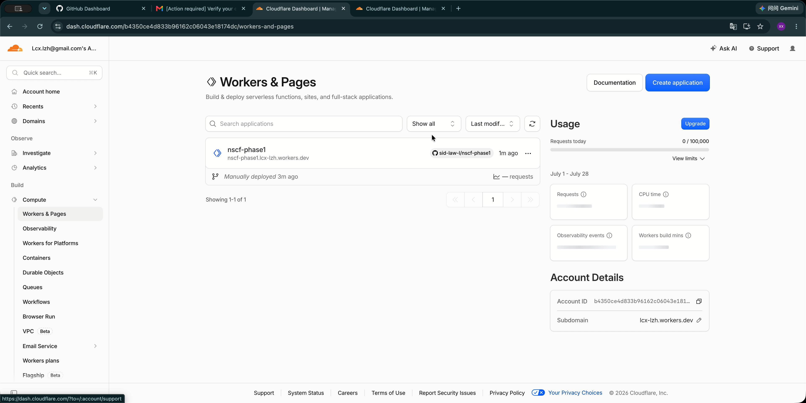

程序名称下方会显示一个以 `workers.dev` 结尾的网址。点击这个网址就可以打开你的 Nightscout。

如果刚部署的程序还没有出现在列表中，请等待几秒钟，然后刷新页面。

---

## 第九步：变量和高级设置（可选）

打开已经部署好的 Worker，然后进入：

**Settings（设置） → Variables and secrets（变量和密钥）**

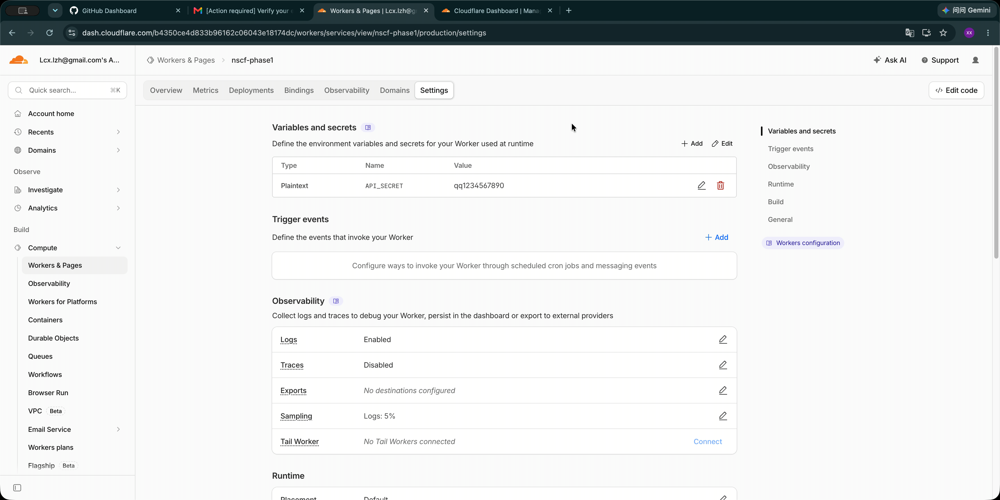

在这里可以：

- 修改现有的 `API_SECRET`
- 添加 Nightscout 高级功能需要的环境变量
- 管理其他运行时设置

修改 `API_SECRET` 后，请记住使用新的密码登录 Nightscout。

> 如果你只是需要查看血糖，并且不需要自定义域名或其他 Nightscout 高级功能，到这里就已经部署完成，可以直接使用。

---

## 第十步：完成第一次使用设置

第一次打开 Nightscout 时，系统会自动进入 **Profile Editor（配置编辑器）**。

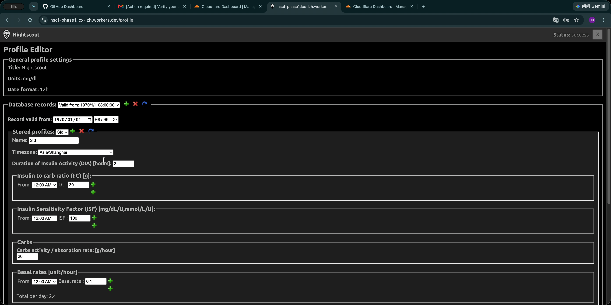

如果你暂时不想填写这些设置，可以直接滚动到页面最底部，完成验证后保存。

你也可以按照自己的实际情况填写配置。这里的设置以后可以随时修改，暂时不理解的项目可以先保持默认值，不必处理。

保存步骤：

1. 滚动到页面底部。
2. 点击 **Authenticate（验证）**。
3. 输入部署时设置的 `API_SECRET`。
4. 验证成功后点击 **Save（保存）**。

> 值得注意的是：保存成功后，页面不会自动跳转回 Nightscout 首页。请点击页面右上角的 **×**，或者在浏览器地址栏中重新输入你的 Nightscout 网址。

---

## 第十一步：连接血糖设备

最后，根据你使用的设备或上传工具，将设备连接到刚刚部署的 Nightscout。

不同设备和上传工具的连接方法并不相同。请先打开 [Nightscout 官方支持的上传器与设备教程](https://nightscout.github.io/uploader/uploaders/)，找到自己使用的设备或软件，再按照对应说明完成连接。

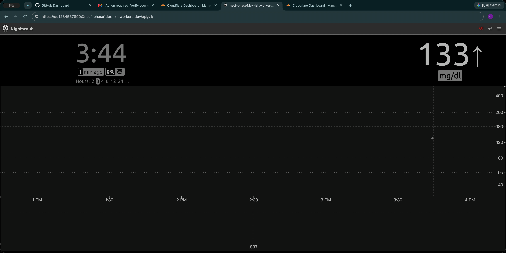

设备连接成功并上传数据后，Nightscout 首页会显示第一条血糖数值和趋势箭头。

至此，Nightscout for Cloudflare 已经部署并完成基础配置。

---

## 接下来可以做什么

完成基础部署后，还可以继续配置：

- Nightscout 环境变量和高级功能
- 自定义域名
- AAPS 连接
- xDrip+ 连接
- Loop 连接
- 其他闭环或血糖上传工具
- Nightscout for Cloudflare 版本更新

这些功能可以分别制作成独立的进阶教程。
