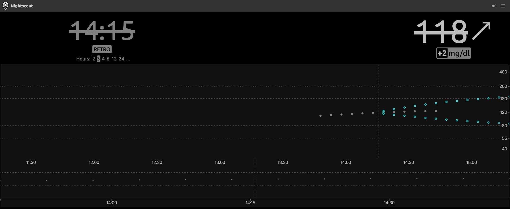

# NSCF phase 1 execution report

Date: 2026-07-17

## Outcome

The expanded phase-one port is implemented and deployed. The independent NSCF
repository vendors the unmodified official Nightscout v15.0.7 release, builds
and serves every official page route, bundle, plugins, translations and Swagger
pages, and stores page-backed simulated records in tenant-sharded SQLite
Durable Objects. No custom dashboard or replacement UI was created.

Public synthetic-data lab:
<https://nscf-phase1.nscf-lab-20260717.workers.dev/>

## Locked upstream

- Release: `v15.0.7` — Blueberry Muffin
- Commit: `7e0e77f88fc113a76fe363504125f5b36b8a3fe3`
- Source archive SHA-256:
  `811ef4f7841457d3ec4a0b793f470835580d989424a8101d24ae0d769aa6896a`
- Tracking: clean vendor snapshot + provenance manifest + explicit patch queue
- Upstream source patches in phase 1: none
- Integrity: all 655 vendored files matched the re-hashed official archive

## Verification evidence

- TypeScript and generated Cloudflare binding checks: passed.
- Workers runtime tests: 15/15 passed, including API_SECRET SHA-1/SHA-512,
  rejection, fail-closed, roles/subjects and access-token coverage.
- Tested: API, SQLite persistence/eviction, tenant isolation, idempotence,
  invalid input, current/history, food, profiles, treatments, device status,
  report aggregation, cleanup, upstream assets and UTF-8 response headers.
- Wrangler dry run: 248 Static Assets entries; Worker 47.84 KiB raw / 11.90 KiB
  gzip.
- Remote API: 12 simulated SGVs inserted; current 124; history/date filters,
  invalid input and isolated tenants passed.
- Remote official client: loading completed; title updated; upstream SVG chart
  rendered simulated history with three paths and 50 circles.
- Local and remote official bundle bytes are identical.
- Workers CPU over 129 invocations: 1 ms median, 2 ms p95, 4 ms maximum.

## Cloudflare resources

- Account subdomain: `nscf-lab-20260717.workers.dev`.
- Worker: `nscf-phase1`.
- Deployment: `40627e717e124e368ffe0f9af51ae19a`.
- SQLite Durable Object namespace: `nscf-phase1_EntryStore`
  (`65a3ccc862724ddaaf1e3d8efdc0ef8b`).
- Workers Static Assets: 214 files, 205 unique content hashes.
- D1/R2/KV/Queues/custom domain: none created.

## Platform findings

1. Workers Free rejects a user-configured `cpu_ms` limit. NSCF relies on the
   Free plan's platform limit; measured CPU stayed below 10 ms.
2. Static Assets omits the UTF-8 charset expected from upstream Express. The
   Worker now streams text assets and supplies the charset without modifying
   their bytes.
3. First-use batch wall time was 23.9 seconds, while later reads were roughly
   0.22–0.65 seconds. Observed CPU stayed low, so the cold delay is external to
   JavaScript CPU execution.
4. The final dashboard API_SECRET no longer matched the earlier smoke-test
   value. The final deployed page/read checks passed, invalid credentials
   correctly returned 401, and the isolated smoke tenant remained empty. The
   credential was not inspected or replaced.

## Known limitations and next phase

- Writes require Nightscout-compatible API_SECRET authentication; reads remain
  public and the lab accepts only synthetic test use.
- Page-used API paths are implemented, but complete historical API v1/v2/v3,
  plugin background jobs and Socket.IO/Engine.IO semantics remain partial.
- Upstream audit findings require a compatibility-aware remediation review.
- Before real personal use, complete API v3 and Engine.IO coverage from actual
  upstream client tests, add rollback/upgrade fixtures for DO schema evolution,
  and repeat load/CPU measurements with a longer representative synthetic
  workload.
- No dosing, insulin recommendation or medical decision functionality should be
  added to the platform adapter.
